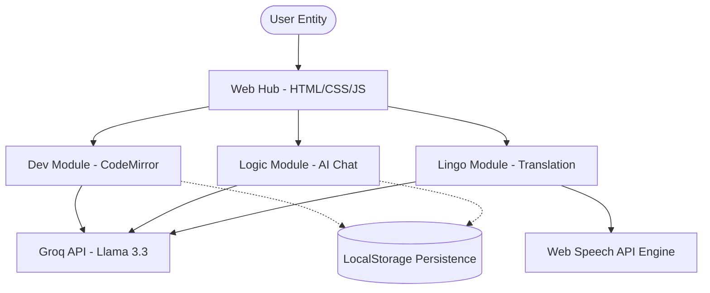

# 🚀 StudifyHub - The Ultimate AI-Powered Student Learning Toolkit

<div align="center">


**🌐 Live Demo:** [premrajsingh.github.io/StudifyHub/](https://premrajsingh.github.io/StudifyHub/)

[](https://github.com/premrajsingh/StudifyHub)
[](https://github.com/premrajsingh/StudifyHub)

[Overview](#-overview) • [Core Features](#-core-features) • [System Architecture](#-system-architecture) • [How It Works](#-how-it-works) • [Tech Stack](#-tech-stack) • [Installation](#-installation)

</div>

---

## 📖 Overview

**StudifyHub** is a high-performance, AI-integrated platform designed specifically for the modern student. It unifies essential academic utilities—a **Smart Code Editor**, an **Intelligent AI Assistant**, and a **Multilingual Translator**—into a single, seamless, and buttery-smooth experience.

### 💡 The Problem & The Solution
Traditional student workflows are often fragmented across multiple browser tabs and disparate tools. This lack of integration leads to "context-switching fatigue." 

**StudifyHub** solves this by providing a unified interface where you can write code, consult an AI for complex logic, and translate research papers simultaneously. Built with a "Zero-DB" architecture, it leverages browser power and state-of-the-art LLMs to deliver a premium toolset without the need for complex server setups.

---

## ✨ Core Features

### 💻 1. Smart Code Editor
*   **AI-Sidekick**: Simulates real-time code execution across JavaScript, Python, Java, C++, and more.
*   **Pro-Grade Editing**: Powered by **CodeMirror**, offering syntax highlighting and an IDE-like feel.
*   **Smart History**: Automatically tracks your last 20 snippets via LocalStorage, so you never lose your progress.
*   **User Impact**: Perfect for quick algorithm testing or learning new syntax without installing heavy compilers.


### 🤖 2. Intelligent AI Assistant
*   **Blazing Speed**: Integrates the **Llama 3.3 70B** model via Groq API for near-instant (sub-500ms) responses.
*   **Conversational Memory**: Maintains a clear, persistent chat history with an elegant sidebar navigation.
*   **Deep Reasoning**: Optimized to handle everything from math problems to architectural advice.


### 🌍 3. Multilingual Translator
*   **Global Reach**: Supports high-accuracy bidirectional translation for 12+ major world languages.
*   **Audio Feedback**: Native **Web Speech API** integration allows you to hear translations with natural-sounding voices.
*   **Efficiency Tools**: Includes language swapping, one-click copy, and a responsive mobile-first UI.


---

## 🏗️ System Architecture

StudifyHub follows a modular, client-side heavy architecture to ensure maximum speed and privacy.



---

## 🛠️ Tech Stack

- **Intelligence Engine**: Groq Cloud API (Llama 3.3 70B Versatile).
- **Core Frontend**: Vanilla JavaScript (ES6+), HTML5, CSS3 (Modern Flex/Grid).
- **UI Frameworks**: Bootstrap 5.3 & Custom Glassmorphic CSS.
- **Specialized Libraries**: CodeMirror (Text editor logic).
- **Native Web APIs**: SpeechSynthesis (TTS), Clipboard API, LocalStorage.

---

## 💼 Skills & Engineering Excellence

| Category | Implementation Highlights |
|----------|---------|
| **Frontend** | Responsive Bootstrap grid, CSS3 micro-animations, Glassmorphism UI. |
| **Logic** | Asynchronous state management, dynamic DOM batching. |
| **API Handling** | Prompt engineering for "Serverless Execution," Rate-limit handling. |
| **UX/UI** | Dark-mode optimized, zero-latency sidebar transitions. |

---

## 🚀 Installation & Configuration

### 1. Clone the Repository
```bash
git clone https://github.com/premrajsingh/StudifyHub.git
cd StudifyHub
```

### 2. Configure Your API Key
To enable the AI features, you must add your **Groq API Key** to the following files:
*   `index01.js` (line 9) - AI Assistant
*   `index5.js` (line 105) - Code Editor
*   `index02.js` (line 1) - Translator

> [!TIP]
> You can get a free API key at [console.groq.com](https://console.groq.com/).

### 3. Launch the Hub
Simply open `index.html` in your favorite browser. No complex dependencies or `npm install` required!

---

## 👨‍💻 Developed By

**Prem Raj Singh**
[GitHub](https://github.com/premrajsingh) • [LinkedIn](https://www.linkedin.com/in/premrajsingh) • [Instagram](https://www.instagram.com/im_premrajsingh_)

---

<div align="center">
⭐ Found this project helpful? Give it a Star! ⭐
</div>
